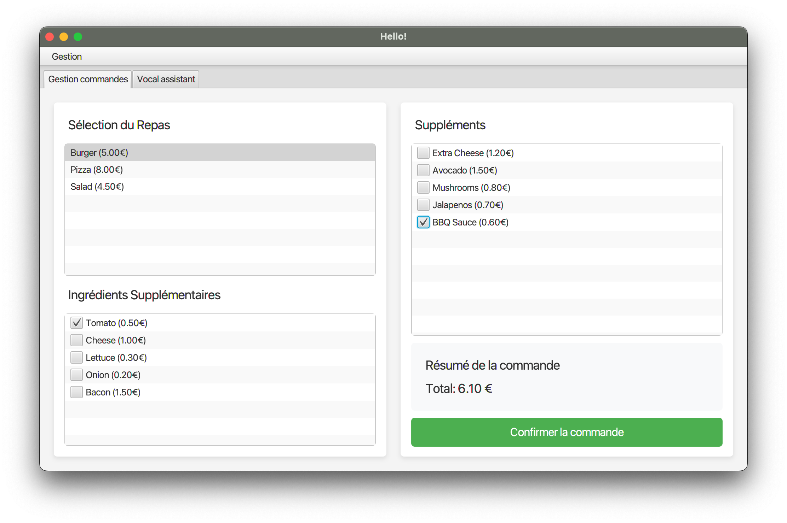
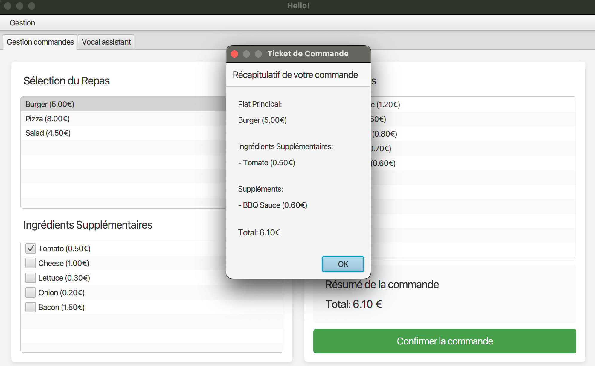
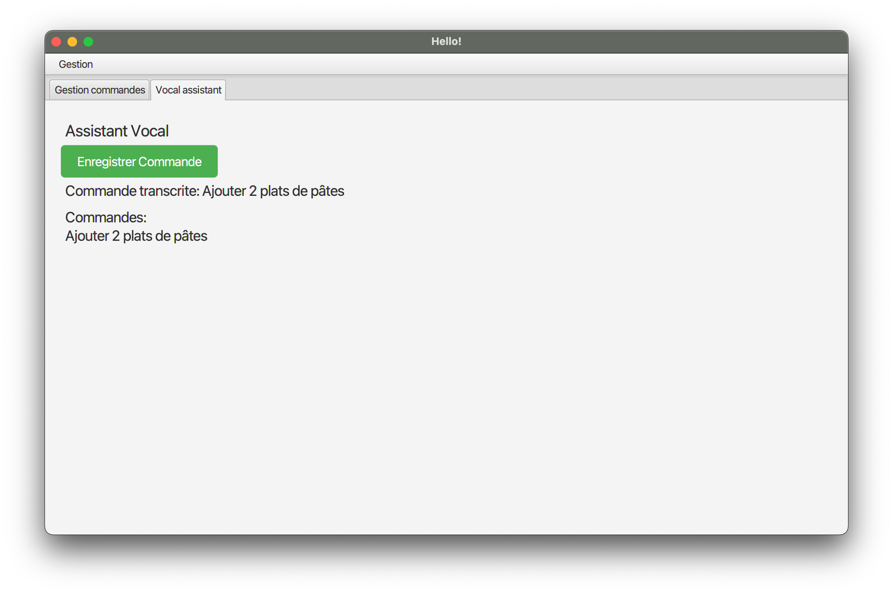
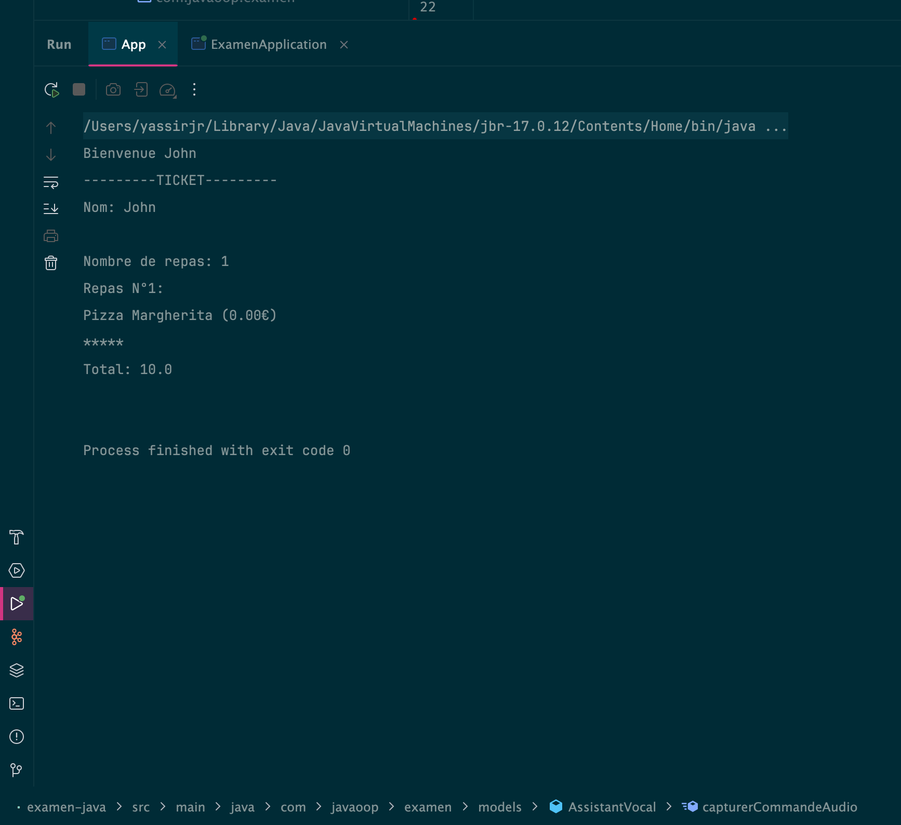
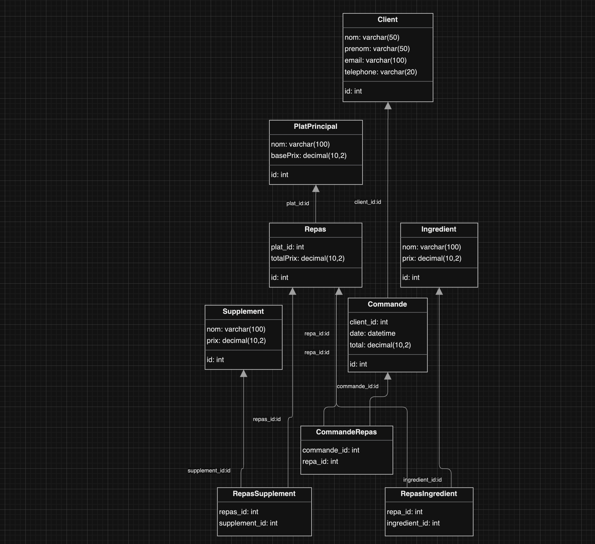
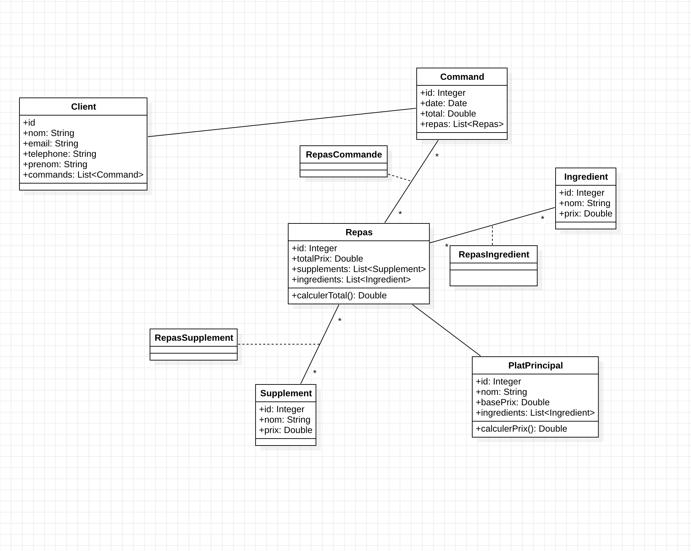

# Java OOP Exam Project

## Project Overview

This project is a JavaFX application that allows users to manage food orders. It includes a virtual assistant feature
for voice command processing and a console application for generating order tickets.

## Result






## MLD Class Diagram




### Explain :

Client :

- id: Unique identifier for each client.
- nom: Client's last name.
- prenom: Client's first name.
- email: Client's email address (must be unique).
- telephone: Client's phone number.

PlatPrincipal :

- id: Unique identifier for each main dish.
- nom: Name of the main dish.
- basePrix: Base price of the main dish.

Ingredient :

- id: Unique identifier for each ingredient.
- nom: Name of the ingredient.
- prix: Price of the ingredient.

Supplement :

- id: Unique identifier for each supplement.
- nom: Name of the supplement.
- prix: Price of the supplement.

Repas :

- id: Unique identifier for each meal.
- plat_id: Foreign key referencing the main dish.
- totalPrix: Total price of the meal.

RepasIngredient :

- repa_id: Foreign key referencing the meal.
- ingredient_id: Foreign key referencing the ingredient.

RepasSupplement :

- repas_id: Foreign key referencing the meal.
- supplement_id: Foreign key referencing the supplement.

Commande :

- id: Unique identifier for each order.
- client_id: Foreign key referencing the client.
- date: Date and time of the order.
- total: Total price of the order.

CommandeRepas :

- commande_id: Foreign key referencing the order.
- repa_id: Foreign key referencing the meal.

Classes :
- Client: Represents a client with attributes such as id, nom, prenom, email, and telephone.
- PlatPrincipal: Represents a main dish with attributes such as id, nom, and basePrix.
- Ingredient: Represents an ingredient with attributes such as id, nom, and prix.
- Supplement: Represents a supplement with attributes such as id, nom, and prix.
- Repas: Represents a meal with attributes such as id, platPrincipal, ingredients, supplements, and totalPrix.
- Commande: Represents an order with attributes such as id, client, date, total, and repas.


### Classes :

## Client

the client class is a simple class that contains the following attributes:

```java
public class Client {
    private int id;
    private String nom;
    private String prenom;
    private String email;
    private String telephone;
}
```

## PlatPrincipal

the PlatPrincipal class is a simple class that contains the following attributes:

```java
public class PlatPrincipal {
    private int id;
    private String nom;
    private double basePrix;
}
```

## Ingredient

the Ingredient class is a simple class that contains the following attributes:

```java
public class Ingredient {
    private int id;
    private String nom;
    private double prix;
}
```

## Supplement

the Supplement class is a simple class that contains the following attributes:

```java
public class Supplement {
    private int id;
    private String nom;
    private double prix;
}
```

## Repas

the Repas class is a simple class that contains the following attributes:

```java
public class Repas {
    private int id;
    private PlatPrincipal platPrincipal;
    private List<Ingredient> ingredients;
    private List<Supplement> supplements;
    private double totalPrix;
}
```

## Commande

the Commande class is a simple class that contains the following attributes:

```java
public class Commande {
    private int id;
    private Client client;
    private LocalDateTime date;
    private double total;
    private List<Repas> repas;
}
```

## DAO Interface

the DAO interface generic is a simple interface that contains the following methods:

```java

public interface DAO<T> {
    List<T> findAll();
    T findById(Integer id);
    T save(T t);
    T update(Integer id , T t);
    void delete(Integer id);
}

```

## ClientDAO

the ClientDAO class is a simple class that implements the DAO interface:

```java
package com.javaoop.examen.dao;

import com.javaoop.examen.database.SingletonConnexionDB;
import com.javaoop.examen.models.Client;
import com.javaoop.examen.models.Command;
import com.javaoop.examen.models.Repas;

import java.sql.*;
import java.util.ArrayList;
import java.util.List;

public class ClientDAO implements DAO<Client> {
    private final Connection connection = SingletonConnexionDB.getConnexion();

    @Override
    public List<Client> findAll() {
        List<Client> clients = new ArrayList<>();
        String query = "SELECT * FROM Client";
        try (Statement statement = connection.createStatement();
             ResultSet resultSet = statement.executeQuery(query)) {
            while (resultSet.next()) {
                clients.add(new Client(
                        resultSet.getInt("id"),
                        resultSet.getString("nom"),
                        resultSet.getString("prenom"),
                        resultSet.getString("email"),
                        resultSet.getString("telephone"),
                        null
                ));
            }
        } catch (SQLException e) {
            e.printStackTrace();
        }
        return clients;
    }

    @Override
    public Client findById(Integer id) {
        Client client = null;
        String query = "SELECT * FROM Client WHERE id = ?";
        try (PreparedStatement statement = connection.prepareStatement(query)) {
            statement.setInt(1, id);
            ResultSet resultSet = statement.executeQuery();
            if (resultSet.next()) {
                client = new Client(
                        resultSet.getInt("id"),
                        resultSet.getString("nom"),
                        resultSet.getString("prenom"),
                        resultSet.getString("email"),
                        resultSet.getString("telephone"),
                        getClientCommands(id)
                );
            }
        } catch (SQLException e) {
            e.printStackTrace();
        }
        return client;
    }

    @Override
    public Client save(Client client) {
        String query = "INSERT INTO Client (nom, prenom, email, telephone) VALUES (?, ?, ?, ?)";
        try (PreparedStatement statement = connection.prepareStatement(query, Statement.RETURN_GENERATED_KEYS)) {
            statement.setString(1, client.getNom());
            statement.setString(2, client.getPrenom());
            statement.setString(3, client.getEmail());
            statement.setString(4, client.getTelephone());
            statement.executeUpdate();

            ResultSet keys = statement.getGeneratedKeys();
            if (keys.next()) {
                client.setId(keys.getInt(1));
            }
        } catch (SQLException e) {
            e.printStackTrace();
        }
        return client;
    }

    @Override
    public Client update(Integer id, Client client) {
        String query = "UPDATE Client SET nom = ?, prenom = ?, email = ?, telephone = ? WHERE id = ?";
        try (PreparedStatement statement = connection.prepareStatement(query)) {
            statement.setString(1, client.getNom());
            statement.setString(2, client.getPrenom());
            statement.setString(3, client.getEmail());
            statement.setString(4, client.getTelephone());
            statement.setInt(5, id);
            statement.executeUpdate();
        } catch (SQLException e) {
            e.printStackTrace();
        }
        return client;
    }

    @Override
    public void delete(Integer id) {
        String query = "DELETE FROM Client WHERE id = ?";
        try (PreparedStatement statement = connection.prepareStatement(query)) {
            statement.setInt(1, id);
            statement.executeUpdate();
        } catch (SQLException e) {
            e.printStackTrace();
        }
    }

    public void addCommand(Integer clientId, Command command) {
        String insertCommand = "INSERT INTO Commande (client_id, total) VALUES (?, ?)";
        String linkRepas = "INSERT INTO CommandeRepas (commande_id, repa_id) VALUES (?, ?)";
        try (PreparedStatement commandStmt = connection.prepareStatement(insertCommand, Statement.RETURN_GENERATED_KEYS)) {
            commandStmt.setInt(1, clientId);
            commandStmt.setDouble(2, command.calculerTotal());
            commandStmt.executeUpdate();

            ResultSet keys = commandStmt.getGeneratedKeys();
            if (keys.next()) {
                command.setId(keys.getInt(1));
                try (PreparedStatement repasStmt = connection.prepareStatement(linkRepas)) {
                    for (Repas repas : command.getRepas()) {
                        repasStmt.setInt(1, command.getId());
                        repasStmt.setInt(2, repas.getId());
                        repasStmt.addBatch();
                    }
                    repasStmt.executeBatch();
                }
            }
        } catch (SQLException e) {
            e.printStackTrace();
        }
    }

    public List<Command> getClientCommands(Integer clientId) {
        List<Command> commands = new ArrayList<>();
        String query = """
                SELECT C.id AS commande_id, C.date, C.total, R.id AS repas_id, R.totalPrix AS repasPrix
                FROM Commande C
                JOIN CommandeRepas CR ON C.id = CR.commande_id
                JOIN Repas R ON CR.repa_id = R.id
                WHERE C.client_id = ?
                """;

        try (PreparedStatement statement = connection.prepareStatement(query)) {
            statement.setInt(1, clientId);
            ResultSet resultSet = statement.executeQuery();
            while (resultSet.next()) {
                int commandId = resultSet.getInt("commande_id");
                Command command = commands.stream().filter(c -> c.getId() == commandId).findFirst().orElse(null);
                if (command == null) {
                    command = Command.builder()
                            .id(commandId)
                            .date(resultSet.getDate("date"))
                            .total(resultSet.getDouble("total"))
                            .repas(new ArrayList<>())
                            .build();
                    commands.add(command);
                }
                command.getRepas().add(Repas.builder()
                        .id(resultSet.getInt("repas_id"))
                        .totalPrix(resultSet.getDouble("repasPrix"))
                        .build());
            }
        } catch (SQLException e) {
            e.printStackTrace();
        }
        return commands;
    }
}
    
```

### Methods :

- findAll(): Retrieve all clients from the database.
- findById(Integer id): Retrieve a client by its id from the database.
- save(Client client): Save a new client to the database.
- update(Integer id, Client client): Update a client by its id in the database.
- delete(Integer id): Delete a client by its id from the database.
- addCommand(Integer clientId, Command command): Add a new command to a client in the database.
- getClientCommands(Integer clientId): Retrieve all commands of a client from the database.


### MainController

the MainController class is a simple class that contains the following methods:

```java
// src/main/java/com/javaoop/examen/controllers/MainController.java
package com.javaoop.examen.controllers;

import com.javaoop.examen.models.*;
import javafx.beans.property.BooleanProperty;
import javafx.beans.property.SimpleBooleanProperty;
import javafx.fxml.FXML;
import javafx.fxml.Initializable;
import javafx.geometry.Insets;
import javafx.scene.control.*;
import javafx.scene.control.cell.CheckBoxListCell;
import javafx.collections.FXCollections;
import javafx.collections.ObservableList;
import javafx.scene.layout.VBox;

import java.net.URL;
import java.util.ArrayList;
import java.util.List;
import java.util.ResourceBundle;

public class MainController implements Initializable {
    @FXML private ListView<PlatPrincipal> platsListView;
    @FXML private ListView<Ingredient> ingredientsListView;
    @FXML private ListView<Supplement> supplementsListView;
    @FXML private Label totalLabel;
    @FXML private Button commandButton;

    private final ObservableList<PlatPrincipal> selectedPlats = FXCollections.observableArrayList();
    private final ObservableList<Ingredient> selectedIngredients = FXCollections.observableArrayList();
    private final ObservableList<Supplement> selectedSupplements = FXCollections.observableArrayList();

    @Override
    public void initialize(URL url, ResourceBundle rb) {
        setupPlatsListView();
        setupIngredientsListView();
        setupSupplementsListView();
        updateTotal();

        commandButton.setOnAction(event -> passCommand());
    }

    private void setupPlatsListView() {
        platsListView.setItems(MockData.getPlats());
        platsListView.getSelectionModel().selectedItemProperty().addListener(
                (obs, oldVal, newVal) -> {
                    if (newVal != null) {
                        updateIngredientsView(newVal);
                        updateTotal();
                    }
                }
        );
    }

    private void setupIngredientsListView() {
        ingredientsListView.setCellFactory(CheckBoxListCell.forListView(item -> {
            BooleanProperty observable = new SimpleBooleanProperty();
            observable.addListener((obs, wasSelected, isNowSelected) -> {
                if (isNowSelected) {
                    selectedIngredients.add(item);
                } else {
                    selectedIngredients.remove(item);
                }
                updateTotal();
            });
            return observable;
        }));
    }

    private void setupSupplementsListView() {
        supplementsListView.setItems(MockData.getSupplements());
        supplementsListView.setCellFactory(CheckBoxListCell.forListView(item -> {
            BooleanProperty observable = new SimpleBooleanProperty();
            observable.addListener((obs, wasSelected, isNowSelected) -> {
                if (isNowSelected) {
                    selectedSupplements.add(item);
                } else {
                    selectedSupplements.remove(item);
                }
                updateTotal();
            });
            return observable;
        }));
    }

    private void updateIngredientsView(PlatPrincipal plat) {
        selectedIngredients.clear();

        ObservableList<Ingredient> availableIngredients = MockData.getIngredients();

        ingredientsListView.setItems(availableIngredients);

        ingredientsListView.getItems().forEach(ingredient -> {
            BooleanProperty observable = new SimpleBooleanProperty(false);
            CheckBoxListCell<Ingredient> cell = (CheckBoxListCell<Ingredient>)
                    ingredientsListView.lookup("#" + ingredient.getId());
            if (cell != null) {
                observable.set(false);
            }
        });
    }

    private void updateTotal() {
        double total = calculateTotal();
        totalLabel.setText(String.format("Total: %.2f €", total));
    }

    private double calculateTotal() {
        double total = 0;
        PlatPrincipal selectedPlat = platsListView.getSelectionModel().getSelectedItem();
        if (selectedPlat != null) {
            total += selectedPlat.getBasePrix();
            total += selectedIngredients.stream().mapToDouble(Ingredient::getPrix).sum();
            total += selectedSupplements.stream().mapToDouble(Supplement::getPrix).sum();
        }
        return total;
    }

    @FXML
    private void handleConfirmOrder() {
        PlatPrincipal selectedPlat = platsListView.getSelectionModel().getSelectedItem();
        if (selectedPlat == null) {
            showAlert("Erreur", "Veuillez sélectionner un plat principal.");
            return;
        }

        Repas repas = Repas.builder()
                .platPrincipal(selectedPlat)
                .ingredients(new ArrayList<>(selectedIngredients))
                .supplements(new ArrayList<>(selectedSupplements))
                .totalPrix(calculateTotal())
                .build();

        showTicket();
    }

    private void showAlert(String title, String content) {
        Alert alert = new Alert(Alert.AlertType.WARNING);
        alert.setTitle(title);
        alert.setContentText(content);
        alert.showAndWait();
    }

    private void clearSelections() {
        platsListView.getSelectionModel().clearSelection();
        selectedIngredients.clear();
        selectedSupplements.clear();
        ingredientsListView.getItems().clear();
        supplementsListView.getItems().forEach(supplement -> {
            BooleanProperty observable = new SimpleBooleanProperty(false);
            CheckBoxListCell<Supplement> cell = (CheckBoxListCell<Supplement>)
                    supplementsListView.lookup("#" + supplement.getId());
            if (cell != null) {
                observable.set(false);
            }
        });
        updateTotal();
    }

    private void showTicket() {
        Dialog<ButtonType> dialog = new Dialog<>();
        dialog.setTitle("Ticket de Commande");
        dialog.setHeaderText("Récapitulatif de votre commande");

        VBox content = new VBox(10);
        content.setPadding(new Insets(20));

        PlatPrincipal selectedPlat = platsListView.getSelectionModel().getSelectedItem();
        if (selectedPlat != null) {
            Label platLabel = new Label("Plat Principal:");
            platLabel.setStyle("-fx-font-weight: bold");
            content.getChildren().add(platLabel);
            content.getChildren().add(new Label(String.format("%s (%.2f€)",
                    selectedPlat.getNom(),
                    selectedPlat.getBasePrix())));
        }

        if (!selectedIngredients.isEmpty()) {
            Label ingredientsLabel = new Label("\nIngrédients Supplémentaires:");
            ingredientsLabel.setStyle("-fx-font-weight: bold");
            content.getChildren().add(ingredientsLabel);
            selectedIngredients.forEach(ingredient ->
                    content.getChildren().add(new Label(String.format("- %s (%.2f€)",
                            ingredient.getNom(), ingredient.getPrix())))
            );
        }

        if (!selectedSupplements.isEmpty()) {
            Label supplementsLabel = new Label("\nSuppléments:");
            supplementsLabel.setStyle("-fx-font-weight: bold");
            content.getChildren().add(supplementsLabel);
            selectedSupplements.forEach(supplement ->
                    content.getChildren().add(new Label(String.format("- %s (%.2f€)",
                            supplement.getNom(), supplement.getPrix())))
            );
        }

        double total = calculateTotal();
        Label totalLabel = new Label(String.format("\nTotal: %.2f€", total));
        totalLabel.setStyle("-fx-font-weight: bold; -fx-font-size: 14px");
        content.getChildren().add(totalLabel);

        dialog.getDialogPane().setContent(content);
        dialog.getDialogPane().getButtonTypes().add(ButtonType.OK);

        dialog.showAndWait()
                .filter(response -> response == ButtonType.OK)
                .ifPresent(response -> clearSelections());
    }


    private void passCommand() {
        PlatPrincipal selectedPlat = platsListView.getSelectionModel().getSelectedItem();
        if (selectedPlat == null) {
            showAlert("Erreur", "Veuillez sélectionner un plat principal.");
            return;
        }

        List<Repas> repasList = MockData.getRepas();

        Command commande = Command.builder()
                .client_id(MockData.getClient().getId()) // Assuming you have a method to get the current client
                .date(new java.util.Date())
                .repas(repasList)
                .total(repasList.stream().reduce(0.0, (total, repas) -> total + repas.getTotalPrix(), Double::sum))
                .build();

        // Save the commande and link it with the repas
        MockData.makeCommand(commande);
        showTicket();
        clearSelections();
    }
}
```

Explaining the code :

- The MainController class is a controller class that handles the main view of the application.
- It contains methods to initialize the view, update the total price, handle the confirm order button, show a ticket, and pass a command.
- The setupPlatsListView() method sets up the main dishes list view.
- The setupIngredientsListView() method sets up the ingredients list view.
- The setupSupplementsListView() method sets up the supplements list view.
- The updateIngredientsView(PlatPrincipal plat) method updates the ingredients view based on the selected main dish.
- The updateTotal() method updates the total price based on the selected main dish, ingredients, and supplements.
- The calculateTotal() method calculates the total price based on the selected main dish, ingredients, and supplements.
- The handleConfirmOrder() method handles the confirm order button action.
- The showAlert(String title, String content) method shows an alert dialog with the given title and content.
- The clearSelections() method clears the selected main dish, ingredients, and supplements.
- The showTicket() method shows a ticket dialog with the selected main dish, ingredients, supplements, and total price.
- The passCommand() method creates a new command with the selected main dish, ingredients, supplements, and total price.
- It then saves the command and shows a ticket dialog.